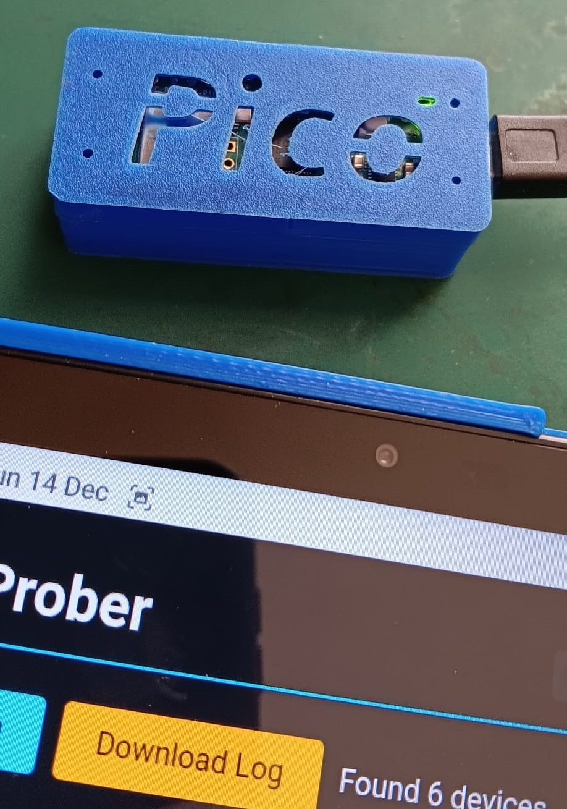
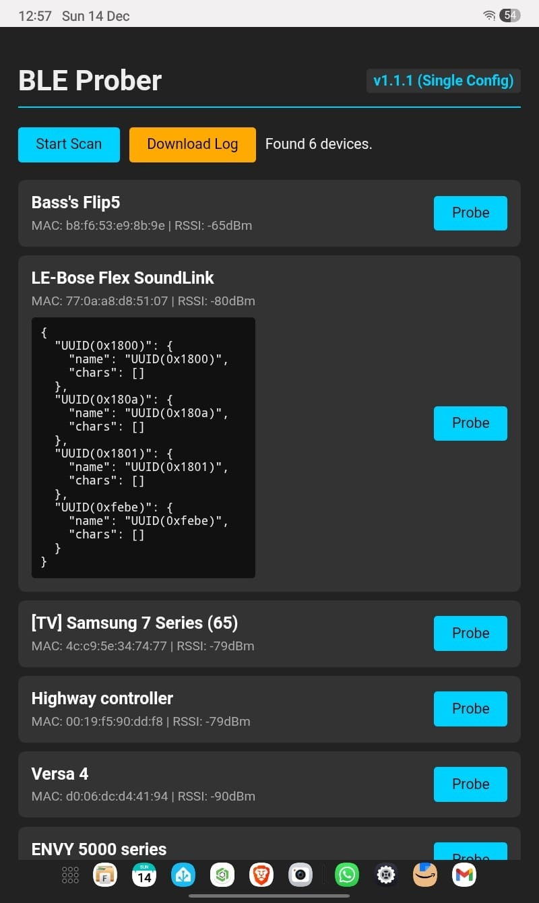

# 📡 TechnoShed BLE Prober

**A robust, headless Bluetooth Low Energy (BLE) investigation tool for the Raspberry Pi Pico W.**

<p align="center">
  
  
</p>


## 📖 Overview

The **BLE Prober** turns a $6 Pico W into a standalone Bluetooth analysis tool. It runs an asynchronous web server that allows you to scan for nearby BLE devices, "probe" them to discover their GATT Services & Characteristics, and download detailed logs—all from your smartphone browser.

It is designed with **robustness** in mind, featuring "Anti-Zombie" logic to handle crashing radio stacks, memory management for long-term stability, and smart time synchronization.

## ✨ Key Features

* **🕵️ Deep Probing:** Connects to target devices to enumerate all exposed Services and Characteristics (UUIDs).
* **📱 Async Web Dashboard:** A dark-mode, responsive web interface hosted directly on the Pico.
* **🧠 Smart Time Sync:** Automatically syncs the Pico's internal clock with your browser's time upon connection—ensuring your logs have accurate timestamps without an RTC battery.
* **🔄 "Anti-Zombie" Radio Logic:** Automatically detects if the Bluetooth stack hangs (Error 107/110) or if a device is refusing connections, and resets the radio state to prevent system freezes.
* **📂 Log Management:** Saves probe reports to `probe_log.txt` which can be downloaded directly from the UI.
* **🚦 Visual Feedback:** Uses the onboard LED to indicate system status (Scanning, Connecting, Error).
* **⚙️ Configurable:** Easily tweak scan duration, RSSI thresholds, and Wi-Fi settings via `config.py`.

## 🛠️ Hardware & Requirements

* **Raspberry Pi Pico W** (RP2040)
* **MicroPython Firmware** (v1.20 or newer recommended)
* **Thonny IDE** (for uploading files)

## 📟 Extended Hardware (Optional)

You can enhance the "Prober" with a display and sensors to get real-time feedback without needing a phone.

* **1602 LCD (I2C):** Displays current status (Scanning/Connecting), Time, and Temperature.
* **BME280 Sensor:** Provides environmental data (Temperature/Humidity).

**Wiring:**
| Device | Pico Pin | Description |
| :--- | :--- | :--- |
| **LCD SDA** | GPIO 14 | I2C Data |
| **LCD SCL** | GPIO 15 | I2C Clock |
| **Sensor SDA** | GPIO 16 | I2C Data |
| **Sensor SCL** | GPIO 17 | I2C Clock |

## 📥 Installation

1.  **Flash MicroPython:** Install the latest MicroPython firmware on your Pico W.
2.  **Install Dependencies:**
    * This project uses `microdot` for the web server and `aioble` for Bluetooth.
    * *Note: Ensure `aioble` and `microdot` libraries are present in your `/lib` folder or root.*
3.  **Upload Project Files:**
    Copy the following files to the root of your Pico:
    * `main.py`
    * `web_server.py`
    * `scanner.py`
    * `status_led.py`
    * `config.py`
    * `index.html`

## 🚀 Usage

### 1. Configuration
Open `config.py` to set your preferences:

```python
# The Hotspot the Pico will create
AP_SSID = "PICO_PROBER"
AP_PASS = "technoshed"

# Scanning Tweaks
SCAN_DURATION_MS = 10000   # 10 Seconds
RSSI_THRESHOLD = -90       # Ignore weak signals
FILTER_NAMED_ONLY = False  # Set True to hide "Unknown" devices